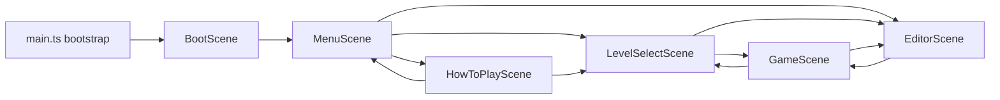

# Architecture

Burn the Village is intentionally split between pure game/data helpers and Phaser scene orchestration. The scenes should stay thin: they compose helpers, draw UI, and route input. The heavy lifting lives in `src/game/`, `src/audio/`, `src/i18n/`, and `src/ui/`.

## Scene Flow

## Module Boundaries

| Area | Main files | Responsibility |
| --- | --- | --- |
| Game constants and tuning | `src/game/constants.ts` | Shared geometry, timing, speed options, brush options, and palette constants |
| Shared audio | `src/audio/catalog.ts`, `src/audio/controller.ts`, `src/audio/gameplay-cues.ts` | Asset catalog, runtime audio state, unlock/mute/music control, and pure gameplay cue detection |
| Shared i18n | `src/i18n/index.ts` | Runtime locale state, translation catalog, built-in level display names, and localized helper copy |
| Core simulation | `src/game/simulation.ts` | Grid state, terrain-aware placement/ignition/explosion rules, scoring, medals, and run outcome gates |
| Level authoring helpers | `src/game/editor-draft.ts`, `src/game/structureCatalog.ts` | Clone/edit a `LevelDefinition`, enforce occupancy and terrain rules, and create structure footprints |
| Level file boundary | `src/game/level-io.ts` | Validate, parse, and serialize the versioned JSON file format |
| Runtime session state | `src/game/session.ts` | In-memory catalog and editor draft for the current browser session |
| How-to-play preview data | `src/game/how-to-play-preview.ts` | Fixed mechanic showcase state plus feature bounds used by the reference scene and its regression tests |
| Shared layout math | `src/ui/layout.ts` | Canonical coordinates, slot geometry, overlay bounds, and spacing contracts that tests lock down |
| Shared rendering | `src/ui/board-renderer.ts`, `src/ui/board-textures.ts`, `src/ui/fire-animation.ts` | Draw board cells, panel frames, flames, textures, and thumbnails |
| Shared UI widgets | `src/ui/pixel-button.ts`, `src/ui/pixel-button-order.ts`, `src/ui/hud-content.ts`, `src/ui/typography.ts` | Buttons, localized HUD copy, rank display, and font loading/sizing |
| DOM bridge | `src/ui/dom-bridge.ts` | Hidden file/text inputs used when canvas-native UI still needs browser input affordances |
| Scene orchestration | `src/scenes/*.ts` | Phaser lifecycle, input wiring, helper composition, and scene transitions |

## State Flow

| Flow | Source | Destination | Notes |
| --- | --- | --- | --- |
| Gameplay start | `LevelDefinition` | `createSimulation(level)` -> `SimulationState` | `GameScene` owns the active simulation object |
| Gameplay tick | `SimulationState` | `stepSimulation(state)` | Simulation advances in phases and returns updated state |
| Editor draft edits | `LevelDefinition` | `toggleFireSource`, `placeStructure`, `paintTerrain`, `removeAt`, direct budget/goal/name edits | `EditorScene` keeps a draft and mirrors it back into `session` |
| Import/export | JSON text | `parseLevelFile` / `serializeLevel` | The JSON boundary is explicit and versioned |
| Session catalog | Built-ins + imported/custom levels | `LevelSelectScene` and `GameScene` lookup | Runtime only; no persistence across reloads |
| Locale state | `src/i18n/index.ts` runtime singleton | All scenes/helpers that render copy | Locale is explicit in helper calls even though the selected value is held in runtime memory |

## Scene Responsibilities

| Scene | Owns | Delegates |
| --- | --- | --- |
| `BootScene` | Minimal startup handoff | Immediately transitions to `MenuScene` |
| `MenuScene` | Splash/menu layout, locale toggle, and navigation | Uses shared frame/layout/button helpers plus the i18n runtime |
| `HowToPlayScene` | Static reference layout, mechanic preview board, and tutorial navigation | Uses shared layout, i18n copy, preview-state helpers, and existing board rendering |
| `LevelSelectScene` | Card rendering, scroll behavior, level import, and navigation | Uses session data, localized display names, thumbnail drawing, layout helpers, and DOM bridge |
| `GameScene` | Active run coordination, placement input, HUD composition, and summary flow | Delegates rules to `simulation.ts` and visuals/layout/copy to shared helpers |
| `EditorScene` | Draft editing UX, import/export/play-test flow, and editor overlays | Delegates draft mutations, validation, localized copy, and DOM input to helpers |

## Ownership Rules

| If you need to change... | Start here | Avoid doing this |
| --- | --- | --- |
| Fire spread, terrain effects, TNT, score, medals, or win/fail timing | `src/game/simulation.ts` | Do not encode game rules directly in `GameScene` |
| Music, mute flow, or gameplay sound triggers | `src/audio/` and `src/ui/global-audio-toggle.ts` | Do not hand-roll scene-local audio state or duplicate unlock/mute behavior |
| Locale state, translated copy, or built-in level display names | `src/i18n/index.ts` and the helper call sites that already accept `locale` | Do not reintroduce scene-local hard-coded English strings for shipped UI |
| Spacing, centering, HUD slot positions, overlay bounds | `src/ui/layout.ts` | Do not scatter new magic numbers across scenes first |
| How-to-play demo contents or label placement | `src/game/how-to-play-preview.ts`, `src/ui/layout.ts`, and the related tests | Do not hand-move one label in-scene without preserving the nearest-label contract |
| Visual style of grass, roofs, flames, or board/frame drawing | `src/ui/board-renderer.ts`, `src/ui/board-textures.ts`, `src/ui/fire-animation.ts` | Do not mix rendering tweaks with game-rule changes unless necessary |
| Button visuals or selected-state behavior | `src/ui/pixel-button.ts`, `src/ui/pixel-button-order.ts` | Do not patch one scene's button instance and leave the shared widget inconsistent |
| JSON import/export contract | `src/game/level-io.ts` | Do not change exported shape ad hoc inside a scene |

## Data Contracts Worth Learning First

| Contract | Why it matters |
| --- | --- |
| `LevelDefinition` | The shared schema for built-in levels, editor drafts, imported files, and gameplay setup |
| `SimulationState` | The authoritative gameplay snapshot used for progression, scoring, rendering, and run summaries |
| `ExportedLevelFile` | The external file format boundary, currently versioned as `2` with backward-compatible `v1` parsing |

## Architectural Intent

- Scene files are intentionally not the smartest files in the repo.
- Shared helper extraction is not over-abstraction; it is a direct response to repeated UI and rendering regressions.
- Tests do not just protect logic. They also protect geometry, layering, readability, and other behavior that lives in helpers rather than in the Phaser scene lifecycle itself.
